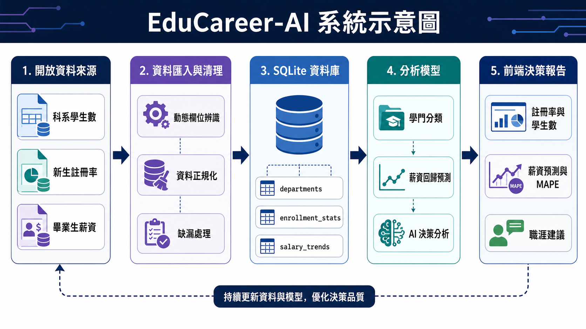

# 開放資料研究與實務期末報告 

EduCareer-AI 高教升學與職涯決策支援系統  

## 一、動機與目的

在升學選填志願或規劃未來職涯時，學生與家長常會同時考量學校聲望、科系興趣、就業前景、薪資成長與市場需求。然而，這些資訊通常分散於不同政府開放資料、教育統計資料與就業薪資資料中，使用者不易快速整合判斷。因此，本計畫希望運用政府開放資料，建立一套「EduCareer-AI 高教升學與職涯決策支援系統」，協助使用者根據學校、科系與職涯偏好，取得較完整的量化分析結果。

本系統主要目的為整合大專校院科系學生數、新生註冊率與畢業生薪資資料，並透過資料庫、回歸預測模型與 AI 決策分析，提供學生在升學與職涯選擇上的參考依據。系統可讓使用者選擇目標學校與科系，並依照「起薪優先」、「科技業」、「公務員學術」、「跨領域發展」、「外商外派」等偏好條件，產生包含註冊率、學生人數、薪資趨勢、風險因素與職涯建議的分析報告。

## 二、資料蒐集

### （一）開放資料

| 資料集名稱 | 106-112 學年大專院校各校科系別學生數 | 學12-1 新生註冊率-以「系（所）」統計 | Student_RPT_19 畢業生投入職場與薪資資料 |
|---|---|---|---|
| 主要欄位說明 | 學年度、學校名稱、科系名稱、總計 | 學年度、學校名稱、系所名稱、新生註冊率 | 學門名稱、學門學類、學士平均月薪、碩士平均月薪、博士平均薪資 |
| 資料資源下載網址 | 教育部統計處／大專校院校務資訊公開平台資料下載檔 | 教育部大專校院校務資訊公開平台學生類資料 | 教育部畢業生流向與就業薪資相關統計資料 |
| 提供機關 | 教育部統計處 | 教育部統計處 | 教育部 |
| 更新頻率 | 依學年度更新 | 依學年度更新 | 依資料發布年度更新 |
| 授權方式 | 政府資料開放授權條款 | 政府資料開放授權條款 | 政府資料開放授權條款 |
| 計費方式 | 免費 | 免費 | 免費 |
| 資料集類型 | JSON/TXT 下載檔 | CSV 下載檔 | CSV 下載檔 |
| 資料用途 | 分析各校各科系在學學生人數 | 分析各科系招生與新生註冊情況 | 建立不同學門畢業後薪資基準 |
| 主題分類 | 教育統計 | 教育統計 | 教育與就業統計 |
| 服務分類 | 求學及進修 | 求學及進修 | 求職及就業 |
| 資料集分類 | 開放資料 | 開放資料 | 開放資料 |
| 關鍵字 | 大專校院、學生數、科系 | 新生註冊率、系所、招生 | 畢業生流向、薪資、學門 |
| 系統對應程式 | `backend/ingestion.py` | `backend/ingestion.py` | `backend/ingestion.py` |

### （二）系統衍生資料

本系統會將上述開放資料匯入 SQLite 資料庫 `educareer.db`，建立三個主要資料表：

1. `departments`：儲存學校名稱、科系名稱與系統推論出的學門分類。
2. `enrollment_stats`：儲存各科系不同學年度的學生數與新生註冊率。
3. `salary_trends`：儲存各學門畢業後 1 年、3 年、5 年的平均薪資資料。

此外，系統也會依據科系名稱關鍵字，自動將科系分類為「資訊工程」、「電機電子」、「商業管理」、「人文社會」、「基礎科學」或「其他學門」，作為後續薪資預測與 AI 分析的基礎。

## 三、研究方法

本計畫採用資料工程、統計預測與 AI 決策分析結合的方式進行研究與系統實作。整體流程為「開放資料蒐集」→「資料清理與正規化」→「資料庫儲存」→「指標計算」→「薪資預測」→「前端決策報告呈現」。透過此流程，原本分散的教育統計資料可以被轉換為學生與家長較容易理解的升學與職涯決策資訊。

首先，系統透過 `backend/ingestion.py` 建立資料匯入管線，讀取大專校院學生數、新生註冊率與畢業生薪資資料。資料匯入時使用動態欄位比對方式，避免未來政府資料欄位名稱變動時造成系統無法執行。例如，系統會自動尋找包含「註冊率」、「學校名稱」、「系所名稱」、「學年度」等關鍵字的欄位，並忽略未知新增欄位，以提升資料處理的穩定性。此設計可對應開放資料常見的欄位名稱調整、格式更動或新增說明欄位等情況。

其次，系統使用 SQLite 與 SQLAlchemy 建立資料庫模型，將學校、科系、學生數、註冊率與薪資趨勢資料正規化儲存。資料庫中主要包含科系基本資料、歷年學生數與註冊率，以及不同學門的薪資趨勢。後端使用 FastAPI 建立 API，提供前端查詢學校科系清單、觸發資料同步、執行薪資預測與產生 AI 決策分析報告。

在薪資預測方面，系統使用 `backend/forecasting.py` 中的回歸模型，包含 Linear Regression、Ridge Regression 與 Polynomial Features 等方法，針對不同學門與畢業後年資預測平均薪資。系統同時計算 MAPE 作為模型誤差指標，若誤差過高，則回傳預測安全性警示，提醒使用者該預測結果僅適合作為參考。

最後，系統透過 `backend/agent.py` 建立多智能體式決策分析。若使用者提供 OpenAI API 金鑰，系統會使用 LangChain 與 OpenAI 模型產生結構化分析；若未提供金鑰，系統也會自動使用 Mock 分析結果，確保前端功能可以完整展示。

## 四、預期結果與應用系統示意圖

本系統前端以 React 與 Vite 建構，使用者可透過網頁介面操作。主要功能包含：

1. 資料庫同步：使用者可點選「資料庫同步」功能，觸發後端資料匯入管線，將政府開放資料與薪資資料寫入 SQLite 資料庫。
2. 學校與科系選擇：系統會從資料庫動態讀取學校與科系清單，使用者可以選擇目標學校及科系。
3. 職涯偏好設定：使用者可選擇起薪優先、科技業、公務員學術、跨領域發展、外商外派等偏好條件。
4. 多智能體分析報告：系統會產生 Evidence Layer、Reasoning Layer、Decision Layer 三層分析結果。
5. 薪資回歸預測：使用者可指定學門與畢業後年資，系統會預測該學門的平均薪資，並顯示模型誤差 MAPE。

圖 1 EduCareer-AI 系統示意圖。系統由開放資料來源開始，經過資料匯入與清理、SQLite 資料庫儲存、分析模型處理，最後於前端產生決策報告。

圖 2 EduCareer-AI 決策分析介面。使用者選擇學校、科系與職涯偏好後，系統會顯示決策支援分數、最新新生註冊率、在學學生人數、歷史薪資基準點、市場需求、風險因素與職涯建議。

圖 3 EduCareer-AI 資料同步介面。系統可透過資料動態歸一化管道，讀取新生註冊率資料與 106-112 學年學生數資料，並同步至後端 SQLite 資料庫。

## 五、實施步驟

1. 資料收集與整理  
   蒐集大專校院科系學生數、新生註冊率與畢業生薪資資料，並放置於 `data` 資料夾。

2. 資料匯入與正規化  
   使用 Python 讀取 JSON、TXT、CSV 檔案，將不同來源資料整理後寫入 SQLite 資料庫。

3. 建立後端 API  
   使用 FastAPI 設計資料同步、學校科系查詢、薪資預測與 AI 分析 API。

4. 建立預測模型  
   使用 scikit-learn 建立薪資回歸預測模型，並透過 MAPE 檢查模型穩定性。

5. 建立前端互動介面  
   使用 React 建立決策控制台、資料同步頁面、分析報告與薪資預測模組。

6. 系統測試與驗證  
   透過 `backend/test_pipeline.py` 測試學門分類、資料匯入管線與 MAPE 計算是否正常。

## 六、預期成果

本計畫預期能建立一套以開放資料為基礎的升學與職涯決策支援系統。系統完成後，使用者可在同一介面中取得特定學校科系的新生註冊率、在學學生人數、所屬學門、薪資基準點、薪資預測值、模型誤差指標與職涯建議，降低自行查找與比對多份開放資料的時間成本。

對學生而言，本系統可作為選填志願與職涯規劃的輔助工具；對學校或教育單位而言，系統也能協助觀察科系招生情況與未來就業趨勢。預期成果包含：完成資料同步功能、建立可查詢之教育資料庫、提供學門薪資預測、產出三層式 AI 決策報告，以及建立可視化操作介面。

## 七、結論

本計畫利用政府教育開放資料與畢業生薪資資料，建置 EduCareer-AI 高教升學與職涯決策支援系統。系統整合資料匯入、資料庫管理、薪資預測與 AI 分析功能，能將原本分散的開放資料轉化為具體的升學與職涯建議。

透過本系統，使用者可以更直觀地了解不同學校與科系的招生狀況、在學人數、薪資趨勢與潛在風險，進而做出更有依據的升學與職涯決策。由於目前系統仍以既有開放資料與簡化分類規則為基礎，分析結果應定位為輔助參考，而非唯一決策依據。未來若能加入更多年度資料、產業需求資料、地區就業機會與實際畢業生流向資料，將可使系統分析結果更加完整，並提高其實務應用價值。

## 參考文獻

1. 教育部統計處，大專校院各校科系別學生數資料，資料檔：`106-112學年大專院校各校科系別學生數(JSON檔).txt`。
2. 教育部大專校院校務資訊公開平台，學12-1 新生（含境外生）註冊率-以「系（所）」統計，資料檔：`學12-1.新生(含境外生)註冊率-以「系(所)」統計.csv`。
3. 教育部畢業生流向與就業薪資相關統計資料，資料檔：`Student_RPT_19`。
4. 教育部大專校院校務資訊公開平台，https://udb.moe.edu.tw/Index。
5. 本系統程式碼：EduCareer-AI 決策支援系統，包含 FastAPI 後端、React 前端、SQLite 資料庫與薪資預測模型。
